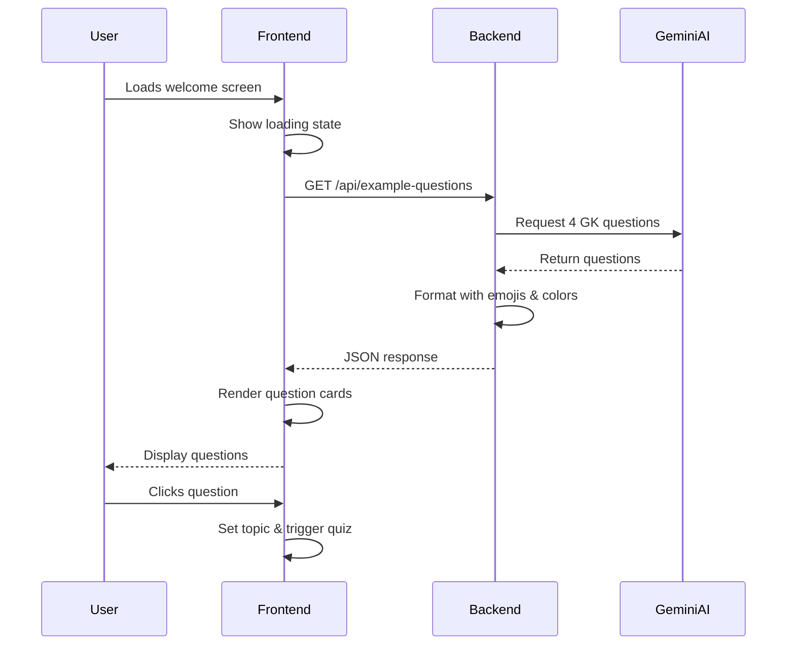

# Design Document

## Overview

This design implements a dynamic question generation system that replaces the hardcoded example questions on the StudyHinter welcome screen with AI-generated GK questions. The solution involves creating a new backend endpoint that uses Gemini AI to generate child-appropriate questions, and updating the frontend to fetch and display these questions on load.

## Architecture

### High-Level Flow

```
User loads page → Frontend requests questions → Backend calls Gemini AI → 
Backend formats response → Frontend displays questions → User clicks question → 
Existing quiz flow continues
```

### Component Interaction



## Components and Interfaces

### Backend Component

#### New Endpoint: `/api/example-questions`

**Location:** `app2-StudyHinter/backend/app/routers/guidance.py`

**Request:**
- Method: GET
- Parameters: None

**Response Model:**
```python
class ExampleQuestion(BaseModel):
    emoji: str
    text: str
    color: str  # Tailwind gradient class

class ExampleQuestionsResponse(BaseModel):
    questions: list[ExampleQuestion]
    warning: Optional[str] = None
```

**Response Example:**
```json
{
  "questions": [
    {
      "emoji": "🌋",
      "text": "How do volcanoes erupt?",
      "color": "from-red-600 to-orange-600"
    },
    {
      "emoji": "🦕",
      "text": "What happened to dinosaurs?",
      "color": "from-green-600 to-teal-600"
    },
    {
      "emoji": "🌙",
      "text": "Why does the moon glow?",
      "color": "from-blue-600 to-purple-600"
    },
    {
      "emoji": "🌊",
      "text": "How do ocean waves work?",
      "color": "from-cyan-600 to-blue-600"
    }
  ],
  "warning": null
}
```

#### Prompt Function

**Function:** `example_questions_prompt()`

**Purpose:** Generate a prompt for Gemini AI to create 4 diverse, child-appropriate GK questions

**Prompt Strategy:**
- Request exactly 4 questions
- Specify topics: science, nature, space, animals, geography, technology
- Require simple phrasing for ages 6-12
- Request JSON format with emoji and text
- Emphasize variety and curiosity-sparking questions

#### Color Assignment Logic

**Predefined Color Palette:**
```python
COLOR_GRADIENTS = [
    "from-red-600 to-orange-600",
    "from-green-600 to-teal-600",
    "from-blue-600 to-purple-600",
    "from-cyan-600 to-blue-600",
    "from-pink-600 to-purple-600",
    "from-yellow-600 to-orange-600",
    "from-indigo-600 to-purple-600",
    "from-teal-600 to-green-600"
]
```

**Assignment:** Randomly select 4 unique colors from the palette for each request

#### Fallback Questions

**Purpose:** Provide default questions if Gemini API fails

**Implementation:** Store a static list of 8 fallback questions, randomly select 4 when needed

### Frontend Component

#### State Management

**New State Variables in App.jsx:**
```javascript
const [exampleQuestions, setExampleQuestions] = useState([]);
const [loadingExamples, setLoadingExamples] = useState(true);
```

#### API Integration

**Function:** `fetchExampleQuestions()`

**Implementation:**
```javascript
const fetchExampleQuestions = async () => {
  setLoadingExamples(true);
  try {
    const response = await fetch('http://localhost:8000/api/example-questions');
    const data = await response.json();
    
    if (data.questions && data.questions.length > 0) {
      setExampleQuestions(data.questions);
    } else {
      // Use hardcoded fallback
      setExampleQuestions(FALLBACK_QUESTIONS);
    }
  } catch (error) {
    console.error('Failed to fetch example questions:', error);
    setExampleQuestions(FALLBACK_QUESTIONS);
  } finally {
    setLoadingExamples(false);
  }
};
```

**Trigger:** Call in `useEffect` on component mount

#### UI Updates

**Loading State:**
- Display skeleton cards or loading spinner while `loadingExamples` is true
- Maintain the same grid layout (2x2 on desktop)

**Question Cards:**
- Replace hardcoded array with `exampleQuestions.map()`
- Use dynamic emoji, text, and color from API response
- Maintain existing hover animations and click handlers

## Data Models

### Backend Models

```python
class ExampleQuestion(BaseModel):
    emoji: str = Field(..., description="Single emoji representing the topic")
    text: str = Field(..., description="Child-friendly question text")
    color: str = Field(..., description="Tailwind gradient class")

class ExampleQuestionsResponse(BaseModel):
    questions: list[ExampleQuestion] = Field(..., min_items=4, max_items=4)
    warning: Optional[str] = None
```

### Frontend Types (TypeScript/JSDoc)

```javascript
/**
 * @typedef {Object} ExampleQuestion
 * @property {string} emoji - Single emoji character
 * @property {string} text - Question text
 * @property {string} color - Tailwind gradient class
 */
```

## Error Handling

### Backend Error Scenarios

1. **Gemini API Failure:**
   - Catch exception from `gemini_complete()`
   - Return fallback questions with warning message
   - Log error for debugging

2. **Invalid JSON Response:**
   - Use `clean_json()` utility to parse response
   - Validate question count (must be 4)
   - Return fallback if validation fails

3. **Missing API Key:**
   - Check `settings.gemini_api_key`
   - Return fallback questions immediately with warning

### Frontend Error Scenarios

1. **Network Failure:**
   - Catch fetch errors
   - Display hardcoded fallback questions
   - Show subtle error indicator (optional)

2. **Timeout:**
   - Set 5-second timeout on fetch request
   - Fall back to hardcoded questions
   - No blocking error message

3. **Invalid Response:**
   - Validate response structure
   - Check for `questions` array with 4 items
   - Use fallback if invalid

### Fallback Strategy

**Backend Fallback Questions:**
```python
FALLBACK_QUESTIONS = [
    {"emoji": "🌋", "text": "How do volcanoes erupt?", "color": "from-red-600 to-orange-600"},
    {"emoji": "🦕", "text": "What happened to dinosaurs?", "color": "from-green-600 to-teal-600"},
    {"emoji": "🌙", "text": "Why does the moon glow?", "color": "from-blue-600 to-purple-600"},
    {"emoji": "🌊", "text": "How do ocean waves work?", "color": "from-cyan-600 to-blue-600"},
    {"emoji": "🌈", "text": "How are rainbows formed?", "color": "from-pink-600 to-purple-600"},
    {"emoji": "⚡", "text": "What causes lightning?", "color": "from-yellow-600 to-orange-600"},
    {"emoji": "🐋", "text": "How do whales breathe underwater?", "color": "from-indigo-600 to-purple-600"},
    {"emoji": "🌍", "text": "Why does Earth have seasons?", "color": "from-teal-600 to-green-600"}
]
```

**Selection:** Randomly pick 4 from the 8 fallback questions

## Testing Strategy

### Backend Testing

1. **Unit Tests:**
   - Test `example_questions_prompt()` returns valid prompt
   - Test color assignment logic selects 4 unique colors
   - Test fallback question selection

2. **Integration Tests:**
   - Test `/api/example-questions` endpoint returns 200
   - Verify response structure matches `ExampleQuestionsResponse`
   - Test with missing Gemini API key (should return fallback)

3. **Manual Testing:**
   - Call endpoint multiple times, verify different questions
   - Verify emojis are appropriate and diverse
   - Check question phrasing is child-friendly

### Frontend Testing

1. **Component Tests:**
   - Test `fetchExampleQuestions()` handles success
   - Test fallback on network error
   - Test loading state transitions

2. **Integration Tests:**
   - Test full flow: load page → fetch questions → display cards
   - Test clicking question card triggers quiz
   - Test refresh generates new questions

3. **Manual Testing:**
   - Verify loading state appears briefly
   - Check question cards render correctly
   - Test with backend offline (should show fallback)
   - Verify animations and hover effects still work

### Performance Considerations

- **Caching:** Consider caching questions in frontend for 5 minutes to reduce API calls on rapid refreshes
- **Timeout:** 5-second timeout prevents indefinite loading
- **Parallel Loading:** Fetch example questions in parallel with other initialization tasks

## Design Decisions

### Why GET instead of POST?
- No parameters needed
- Simpler frontend implementation
- RESTful convention for retrieving data

### Why 4 questions?
- Matches existing UI layout (2x2 grid)
- Provides variety without overwhelming
- Fits well on mobile and desktop

### Why fallback questions?
- Ensures app always works even if API fails
- Provides good user experience during outages
- Maintains app functionality for demo purposes

### Why random color assignment?
- Ensures visual variety
- Prevents color-topic associations that might limit creativity
- Simpler than AI-generated color matching

### Why not cache questions in backend?
- Each user should see fresh questions
- Encourages exploration and curiosity
- Backend is stateless and scalable
