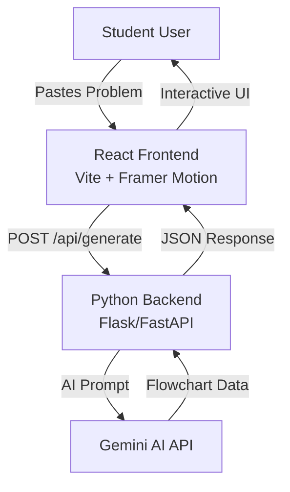

# Design Document

## Overview

LogicHinter is a full-stack web application consisting of a Python backend API and a React frontend. The backend uses the Gemini AI API to generate interactive problem-solving flowcharts, while the frontend provides an engaging, animated user experience using Framer Motion.

## Architecture

### High-Level Architecture



### Technology Stack

**Backend:**
- Python 3.10+
- Flask or FastAPI (REST API framework)
- Google Generative AI SDK (Gemini)
- python-dotenv (environment configuration)
- cryptography library (for crypto.py utilities)

**Frontend:**
- React 18+
- Vite (build tool)
- Framer Motion (animations)
- Axios or Fetch API (HTTP client)
- React Router (if multi-page)
- Tailwind CSS or styled-components (styling)

## Project Structure

### Backend Structure

```
backend/
├── config.py              # Configuration management and environment variables
├── crypto.py              # Encryption/decryption utilities for sensitive data
├── gemini_client.py       # Gemini AI API client and prompt engineering
├── app.py                 # Main application entry point (Flask/FastAPI)
├── routes/
│   └── api.py            # API route handlers
├── models/
│   └── flowchart.py      # Data models for flowchart structure
├── utils/
│   └── validators.py     # Input validation utilities
├── requirements.txt       # Python dependencies
├── .env.example          # Example environment variables
└── .gitignore            # Git ignore file
```

### Frontend Structure

```
frontend/
├── public/
│   └── vite.svg
├── src/
│   ├── main.jsx          # Application entry point
│   ├── App.jsx           # Root component
│   ├── components/
│   │   ├── ProblemInput.jsx       # Problem submission form
│   │   ├── FlowchartView.jsx     # Main flowchart display
│   │   ├── StepNode.jsx           # Individual step component
│   │   ├── ChoiceButton.jsx      # Choice option button
│   │   ├── ErrorFeedback.jsx     # Error message display
│   │   └── LoadingSpinner.jsx    # Loading indicator
│   ├── hooks/
│   │   └── useFlowchart.js       # Custom hook for flowchart state
│   ├── services/
│   │   └── api.js                # API client for backend communication
│   ├── utils/
│   │   └── animations.js         # Framer Motion animation variants
│   ├── styles/
│   │   └── index.css             # Global styles
│   └── types/
│       └── flowchart.js          # Type definitions/PropTypes
├── index.html
├── vite.config.js
├── package.json
├── .env.example
└── .gitignore
```

## Components and Interfaces

### Backend Components

#### 1. config.py

**Purpose:** Centralized configuration management

**Responsibilities:**
- Load environment variables from .env file
- Provide configuration constants (API keys, ports, CORS origins)
- Validate required configuration on startup

**Interface:**
```python
class Config:
    GEMINI_API_KEY: str
    API_HOST: str
    API_PORT: int
    CORS_ORIGINS: list
    DEBUG: bool
    
    @staticmethod
    def validate() -> bool
```

#### 2. crypto.py

**Purpose:** Security utilities for sensitive data handling

**Responsibilities:**
- Encrypt/decrypt sensitive data if needed
- Generate secure tokens or hashes
- Provide utility functions for data sanitization

**Interface:**
```python
def encrypt_data(data: str, key: str) -> str
def decrypt_data(encrypted: str, key: str) -> str
def sanitize_input(text: str) -> str
def generate_session_token() -> str
```

#### 3. gemini_client.py

**Purpose:** Interface with Gemini AI API

**Responsibilities:**
- Initialize Gemini AI client with API key
- Construct prompts for flowchart generation
- Parse AI responses into structured flowchart data
- Handle API errors and retries

**Interface:**
```python
class GeminiClient:
    def __init__(self, api_key: str)
    
    def generate_flowchart(self, problem: str) -> dict
    
    def _build_prompt(self, problem: str) -> str
    
    def _parse_response(self, response: str) -> dict
    
    def _validate_flowchart(self, flowchart: dict) -> bool
```

#### 4. app.py

**Purpose:** Main application setup and server initialization

**Responsibilities:**
- Initialize Flask/FastAPI application
- Configure CORS
- Register routes
- Set up error handlers
- Start server

#### 5. routes/api.py

**Purpose:** API endpoint handlers

**Endpoints:**
- `POST /api/generate` - Generate flowchart from problem
- `GET /api/health` - Health check endpoint

**Request/Response Format:**

```json
// POST /api/generate Request
{
  "problem": "Given an array of integers, find two numbers that add up to a target sum."
}

// POST /api/generate Response
{
  "success": true,
  "flowchart": {
    "steps": [
      {
        "id": "step-1",
        "description": "Choose the initial approach",
        "choices": [
          {
            "id": "choice-1",
            "text": "Use nested loops to check all pairs",
            "correct": false,
            "explanation": "This approach works but has O(n²) time complexity, which is inefficient for large arrays."
          },
          {
            "id": "choice-2",
            "text": "Use a hash map to store complements",
            "correct": true,
            "explanation": null
          },
          {
            "id": "choice-3",
            "text": "Sort the array first",
            "correct": false,
            "explanation": "Sorting adds O(n log n) complexity and doesn't directly solve the problem without additional steps."
          }
        ]
      }
      // ... more steps
    ]
  }
}
```

### Frontend Components

#### 1. ProblemInput.jsx

**Purpose:** Problem submission interface

**Props:** None (uses callback to parent)

**State:**
- `problemText`: string
- `isSubmitting`: boolean

**Behavior:**
- Textarea for problem input
- Submit button with loading state
- Character count display
- Clear button

#### 2. FlowchartView.jsx

**Purpose:** Main container for flowchart display

**Props:**
- `flowchartData`: object
- `onComplete`: function

**State:**
- `currentStepIndex`: number
- `completedSteps`: array
- `showError`: boolean
- `errorMessage`: string

**Behavior:**
- Renders current step
- Manages step progression
- Handles choice selection
- Displays error feedback

#### 3. StepNode.jsx

**Purpose:** Display individual flowchart step

**Props:**
- `step`: object
- `onChoiceSelect`: function
- `isActive`: boolean

**Behavior:**
- Animated entry/exit with Framer Motion
- Displays step description
- Renders three choice buttons
- Shows step number/progress

#### 4. ChoiceButton.jsx

**Purpose:** Interactive choice option button

**Props:**
- `choice`: object
- `onSelect`: function
- `isSelected`: boolean
- `isDisabled`: boolean

**Behavior:**
- Hover animations
- Click feedback
- Visual states (default, selected, disabled)
- Smooth transitions

#### 5. ErrorFeedback.jsx

**Purpose:** Display error messages for wrong choices

**Props:**
- `message`: string
- `onDismiss`: function
- `isVisible`: boolean

**Behavior:**
- Animated modal/toast
- Auto-dismiss option
- Retry button
- Slide/fade animations

### API Service (frontend/src/services/api.js)

```javascript
class ApiService {
  constructor(baseURL) {
    this.baseURL = baseURL;
  }
  
  async generateFlowchart(problem) {
    // POST request to backend
    // Returns flowchart data or throws error
  }
  
  async healthCheck() {
    // GET request to health endpoint
  }
}
```

## Data Models

### Flowchart Structure

```javascript
{
  steps: [
    {
      id: string,              // Unique step identifier
      description: string,     // Step description/question
      choices: [
        {
          id: string,          // Unique choice identifier
          text: string,        // Choice text
          correct: boolean,    // Is this the correct choice?
          explanation: string | null  // Why this choice is wrong (null if correct)
        }
      ]
    }
  ]
}
```

### Application State (Frontend)

```javascript
{
  problem: string | null,
  flowchart: Flowchart | null,
  currentStepIndex: number,
  completedSteps: string[],      // Array of completed step IDs
  selectedChoices: Map<string, string>,  // stepId -> choiceId
  isLoading: boolean,
  error: string | null
}
```

## Error Handling

### Backend Error Handling

1. **API Key Missing/Invalid**
   - Log error on startup
   - Return 500 Internal Server Error
   - Prevent server from starting in production

2. **Gemini API Errors**
   - Retry logic (max 3 attempts)
   - Timeout after 30 seconds
   - Return 503 Service Unavailable with user-friendly message

3. **Invalid Input**
   - Validate problem text (not empty, reasonable length)
   - Return 400 Bad Request with validation errors

4. **Rate Limiting**
   - Implement rate limiting per IP
   - Return 429 Too Many Requests

### Frontend Error Handling

1. **Network Errors**
   - Display user-friendly error message
   - Provide retry button
   - Show offline indicator if applicable

2. **Invalid Response**
   - Validate flowchart structure
   - Fallback to error state
   - Log error for debugging

3. **User Input Errors**
   - Real-time validation
   - Clear error messages
   - Prevent submission of invalid data

## Testing Strategy

### Backend Testing

1. **Unit Tests**
   - Test `gemini_client.py` prompt generation and response parsing
   - Test `crypto.py` encryption/decryption functions
   - Test `config.py` validation logic
   - Mock Gemini API responses

2. **Integration Tests**
   - Test API endpoints with mock Gemini client
   - Test error handling flows
   - Test CORS configuration

3. **API Tests**
   - Test with actual Gemini API (in staging)
   - Validate response formats
   - Test rate limiting

### Frontend Testing

1. **Component Tests**
   - Test each component in isolation
   - Test user interactions (clicks, input)
   - Test conditional rendering

2. **Integration Tests**
   - Test complete user flow
   - Test API integration with mock backend
   - Test error scenarios

3. **E2E Tests**
   - Test full application flow from problem input to completion
   - Test animations and transitions
   - Test responsive design

## Security Considerations

1. **API Key Protection**
   - Store in environment variables
   - Never commit to version control
   - Use .env.example for documentation

2. **Input Sanitization**
   - Sanitize user input before sending to Gemini
   - Prevent injection attacks
   - Limit input length

3. **CORS Configuration**
   - Whitelist specific frontend origins
   - Don't use wildcard (*) in production

4. **Rate Limiting**
   - Prevent abuse of Gemini API
   - Implement per-IP rate limits
   - Consider user authentication for higher limits

## Performance Considerations

1. **Backend**
   - Cache common problem patterns (optional future enhancement)
   - Implement request timeout (30s)
   - Use async/await for non-blocking operations

2. **Frontend**
   - Lazy load components
   - Optimize Framer Motion animations
   - Debounce user input
   - Show loading states immediately

## Deployment

### Backend Deployment
- Deploy to cloud platform (Heroku, Railway, Render, or AWS)
- Set environment variables in platform
- Use production WSGI server (Gunicorn)

### Frontend Deployment
- Build with `npm run build`
- Deploy to Vercel, Netlify, or similar
- Configure environment variables for API URL
- Enable HTTPS

## Future Enhancements

1. User accounts and progress tracking
2. Multiple difficulty levels
3. Support for different programming languages
4. Hints system before showing full explanation
5. Code editor integration for testing solutions
6. Community-submitted problems
7. Performance analytics and insights
