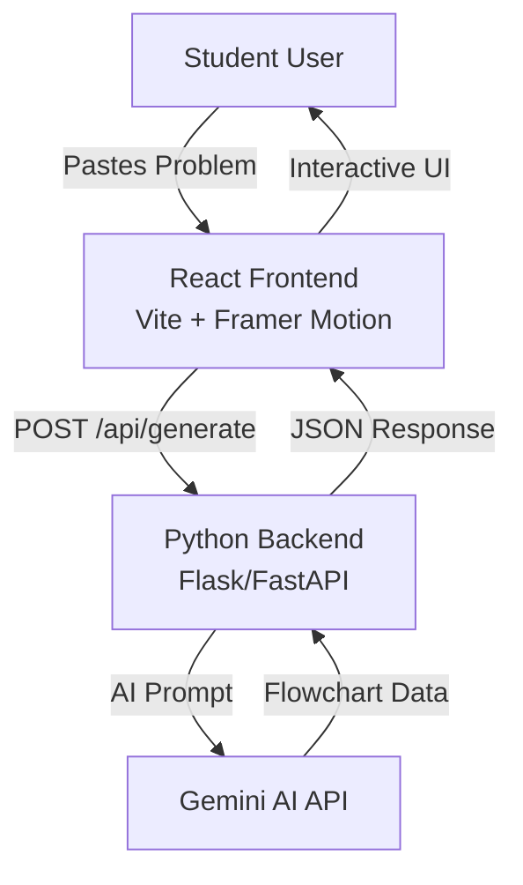

# Design Document

## Overview

LogicHinter is a full-stack web application consisting of a Python backend API and a React frontend. The backend serves as a **skeleton code template** (Skeleton Crew category) - a lean, flexible foundation that can be adapted for various AI-guided learning applications. The frontend features a **haunting, spooky UI** (Costume Contest category) that transforms learning into an immersive experience. 

**Core Philosophy:** LogicHinter is a coding brainstorm buddy that helps students *think*, not copy. Instead of jumping to YouTube tutorials or direct solutions, students engage with an interactive flowchart that guides their problem-solving process step by step.

## Architecture

### High-Level Architecture



### Technology Stack

**Backend:**
- Python 3.10+
- Flask or FastAPI (REST API framework)
- Google Generative AI SDK (Gemini)
- python-dotenv (environment configuration)
- cryptography library (for crypto.py utilities)

**Frontend:**
- React 18+
- Vite (build tool)
- Framer Motion (animations for spooky effects)
- Axios or Fetch API (HTTP client)
- Tailwind CSS (for rapid spooky styling)
- Custom CSS for haunting visual effects (fog, shadows, glows)

## Project Structure

### Backend Structure

```
backend/
├── config.py              # Configuration management and environment variables
├── crypto.py              # Encryption/decryption utilities for sensitive data
├── gemini_client.py       # Gemini AI API client and prompt engineering
├── app.py                 # Main application entry point (Flask/FastAPI)
├── routes/
│   └── api.py            # API route handlers
├── models/
│   └── flowchart.py      # Data models for flowchart structure
├── utils/
│   └── validators.py     # Input validation utilities
├── requirements.txt       # Python dependencies
├── .env.example          # Example environment variables
└── .gitignore            # Git ignore file
```

### Frontend Structure (Spooky Theme)

```
frontend/
├── public/
│   ├── fonts/                    # Spooky fonts (Creepster, Nosifer, etc.)
│   └── sounds/                   # Optional: ambient sounds, error sounds
├── src/
│   ├── main.jsx                  # Application entry point
│   ├── App.jsx                   # Root component with dark theme
│   ├── components/
│   │   ├── ProblemInput.jsx      # Haunted text input with glowing effects
│   │   ├── FlowchartView.jsx    # Graveyard-themed flowchart display
│   │   ├── StepNode.jsx          # Tombstone/ghost-styled step nodes
│   │   ├── ChoiceButton.jsx     # Spooky interactive buttons (coffins/potions)
│   │   ├── ErrorFeedback.jsx    # Ghostly error messages with animations
│   │   ├── LoadingSpinner.jsx   # Haunting loading animation (spinning skull/cauldron)
│   │   ├── SpookyBackground.jsx # Animated fog, floating particles, cobwebs
│   │   └── SuccessAnimation.jsx # Celebration effect when correct choice
│   ├── hooks/
│   │   └── useFlowchart.js      # Custom hook for flowchart state
│   ├── services/
│   │   └── api.js               # API client for backend communication
│   ├── utils/
│   │   └── animations.js        # Spooky Framer Motion variants
│   ├── styles/
│   │   ├── index.css            # Global dark theme styles
│   │   └── spooky.css           # Custom spooky effects (glows, shadows, fog)
│   └── types/
│       └── flowchart.js         # Type definitions/PropTypes
├── index.html
├── vite.config.js
├── package.json
├── .env.example
└── .gitignore
```

## Components and Interfaces

### Backend Components

#### 1. config.py

**Purpose:** Centralized configuration management

**Responsibilities:**
- Load environment variables from .env file
- Provide configuration constants (API keys, ports, CORS origins)
- Validate required configuration on startup

**Interface:**
```python
class Config:
    GEMINI_API_KEY: str
    API_HOST: str
    API_PORT: int
    CORS_ORIGINS: list
    DEBUG: bool
    
    @staticmethod
    def validate() -> bool
```

#### 2. crypto.py

**Purpose:** Security utilities for sensitive data handling

**Responsibilities:**
- Encrypt/decrypt sensitive data if needed
- Generate secure tokens or hashes
- Provide utility functions for data sanitization

**Interface:**
```python
def encrypt_data(data: str, key: str) -> str
def decrypt_data(encrypted: str, key: str) -> str
def sanitize_input(text: str) -> str
def generate_session_token() -> str
```

#### 3. gemini_client.py

**Purpose:** Interface with Gemini AI API

**Responsibilities:**
- Initialize Gemini AI client with API key
- Construct prompts for flowchart generation
- Parse AI responses into structured flowchart data
- Handle API errors and retries

**Interface:**
```python
class GeminiClient:
    def __init__(self, api_key: str)
    
    def generate_flowchart(self, problem: str) -> dict
    
    def _build_prompt(self, problem: str) -> str
    
    def _parse_response(self, response: str) -> dict
    
    def _validate_flowchart(self, flowchart: dict) -> bool
```

#### 4. app.py

**Purpose:** Main application setup and server initialization

**Responsibilities:**
- Initialize Flask/FastAPI application
- Configure CORS
- Register routes
- Set up error handlers
- Start server

#### 5. routes/api.py

**Purpose:** API endpoint handlers

**Endpoints:**
- `POST /api/generate` - Generate flowchart from problem
- `GET /api/health` - Health check endpoint

**Request/Response Format:**

```json
// POST /api/generate Request
{
  "problem": "Given an array of integers, find two numbers that add up to a target sum."
}

// POST /api/generate Response
{
  "success": true,
  "flowchart": {
    "steps": [
      {
        "id": "step-1",
        "description": "Choose the initial approach",
        "choices": [
          {
            "id": "choice-1",
            "text": "Use nested loops to check all pairs",
            "correct": false,
            "explanation": "This approach works but has O(n²) time complexity, which is inefficient for large arrays."
          },
          {
            "id": "choice-2",
            "text": "Use a hash map to store complements",
            "correct": true,
            "explanation": null
          },
          {
            "id": "choice-3",
            "text": "Sort the array first",
            "correct": false,
            "explanation": "Sorting adds O(n log n) complexity and doesn't directly solve the problem without additional steps."
          }
        ]
      }
      // ... more steps
    ]
  }
}
```

### Frontend Components

#### 1. ProblemInput.jsx (Haunted Input)

**Purpose:** Spooky problem submission interface

**Props:** None (uses callback to parent)

**State:**
- `problemText`: string
- `isSubmitting`: boolean

**Spooky Design Elements:**
- Dark textarea with glowing purple/green border on focus
- Floating placeholder text with eerie animation
- Submit button styled as a mystical tome or cauldron
- Ghostly character count that fades in/out
- Fog effect around the input area
- Pulsing glow effect when typing

#### 2. FlowchartView.jsx (Graveyard Journey)

**Purpose:** Main container for spooky flowchart display

**Props:**
- `flowchartData`: object
- `onComplete`: function

**State:**
- `currentStepIndex`: number
- `completedSteps`: array
- `showError`: boolean
- `errorMessage`: string

**Spooky Design Elements:**
- Graveyard/haunted forest background theme
- Path of tombstones representing completed steps
- Fog rolling across the screen
- Floating ghost particles in background
- Eerie ambient glow effects
- Progress shown as a winding path through darkness
- Completion triggers a mystical celebration effect

#### 3. StepNode.jsx (Tombstone/Crystal Ball)

**Purpose:** Display individual flowchart step with haunting style

**Props:**
- `step`: object
- `onChoiceSelect`: function
- `isActive`: boolean

**Spooky Design Elements:**
- Styled as a tombstone, crystal ball, or ancient scroll
- Glowing runes or mystical symbols
- Ethereal entrance animation (fade from mist)
- Pulsing glow around active step
- Creepy typography for step description
- Floating animation (gentle hover effect)
- Shadow effects and depth

#### 4. ChoiceButton.jsx (Potion Bottles/Coffins)

**Purpose:** Spooky interactive choice buttons

**Props:**
- `choice`: object
- `onSelect`: function
- `isSelected`: boolean
- `isDisabled`: boolean

**Spooky Design Elements:**
- Styled as potion bottles, coffins, or spell books
- Different colored glows for each option (purple, green, red)
- Hover effect: intensified glow, slight levitation
- Click effect: magical sparkles or dark energy burst
- Selected state: bright pulsing glow
- Wrong choice: cracking/shattering animation
- Correct choice: triumphant glow effect
- Eerie shadows and 3D depth

#### 5. ErrorFeedback.jsx (Ghostly Warning)

**Purpose:** Display haunting error messages for wrong choices

**Props:**
- `message`: string
- `onDismiss`: function
- `isVisible`: boolean

**Spooky Design Elements:**
- Appears as a ghost, phantom, or dark spirit
- Emerges from shadows with eerie animation
- Red/orange glowing text (like fire or warning)
- Floating/hovering effect
- Wispy smoke or fog trails
- Dismiss button styled as "banish" or "understood"
- Screen darkens/blurs behind the error
- Creepy sound effect (optional)
- Shaking or trembling animation

#### 6. SpookyBackground.jsx

**Purpose:** Atmospheric background effects

**Props:** None

**Spooky Design Elements:**
- Animated fog/mist layers moving across screen
- Floating particles (fireflies, embers, spirits)
- Subtle cobweb overlays in corners
- Vignette effect (darker edges)
- Parallax scrolling for depth
- Occasional lightning flashes (subtle)
- Starry night sky or haunted forest backdrop

#### 7. LoadingSpinner.jsx (Mystical Loading)

**Purpose:** Haunting loading animation

**Props:**
- `message`: string (optional)

**Spooky Design Elements:**
- Spinning skull, cauldron, or mystical rune circle
- Glowing particles orbiting the spinner
- Pulsing glow effect
- "Summoning your guidance..." or similar spooky text
- Fog swirling around the spinner
- Ethereal color transitions

#### 8. SuccessAnimation.jsx

**Purpose:** Celebration when correct choice is made

**Props:**
- `isVisible`: boolean

**Spooky Design Elements:**
- Mystical sparkles or magical energy burst
- Brief screen flash (green/gold glow)
- Floating runes or symbols
- Triumphant but still thematic (not too cheerful)
- Quick animation (1-2 seconds)

## Spooky Design System

### Color Palette

**Primary Colors:**
- Background: Deep blacks (#0a0a0a, #1a1a1a)
- Accent Dark: Dark purple (#2d1b4e, #4a2c6d)
- Accent Bright: Neon purple (#a855f7, #c084fc)
- Success: Eerie green (#10b981, #34d399)
- Error: Blood red (#ef4444, #f87171)
- Warning: Ghostly orange (#f59e0b, #fbbf24)

**Glow Effects:**
- Purple glow: 0 0 20px rgba(168, 85, 247, 0.5)
- Green glow: 0 0 20px rgba(16, 185, 129, 0.5)
- Red glow: 0 0 20px rgba(239, 68, 68, 0.5)

### Typography

**Fonts:**
- Headers: "Creepster", "Nosifer", or "Eater" (Google Fonts)
- Body: "Roboto Mono" or "Space Mono" (readable but atmospheric)
- Accent: "Special Elite" for handwritten/ancient text feel

**Text Effects:**
- Text shadows for depth
- Subtle glow on important text
- Letter spacing for dramatic effect

### Animation Principles

**Timing:**
- Slow, eerie movements (0.5-1s transitions)
- Floating effects (2-4s infinite loops)
- Quick, sharp reactions to user input (0.2s)

**Effects:**
- Fade in from darkness
- Slide from shadows
- Glow intensification
- Particle dispersal
- Shake/tremble for errors
- Smooth levitation

### Interactive Feedback

**Hover States:**
- Glow intensifies
- Slight scale increase (1.05x)
- Shadow deepens
- Cursor changes to mystical pointer

**Click States:**
- Brief flash
- Particle burst
- Scale pulse
- Sound effect (optional)

**Focus States:**
- Pulsing glow border
- Increased brightness
- Accessibility-compliant contrast

### API Service (frontend/src/services/api.js)

```javascript
class ApiService {
  constructor(baseURL) {
    this.baseURL = baseURL;
  }
  
  async generateFlowchart(problem) {
    // POST request to backend
    // Returns flowchart data or throws error
  }
  
  async healthCheck() {
    // GET request to health endpoint
  }
}
```

## Data Models

### Flowchart Structure

```javascript
{
  steps: [
    {
      id: string,              // Unique step identifier
      description: string,     // Step description/question
      choices: [
        {
          id: string,          // Unique choice identifier
          text: string,        // Choice text
          correct: boolean,    // Is this the correct choice?
          explanation: string | null  // Why this choice is wrong (null if correct)
        }
      ]
    }
  ]
}
```

### Application State (Frontend)

```javascript
{
  problem: string | null,
  flowchart: Flowchart | null,
  currentStepIndex: number,
  completedSteps: string[],      // Array of completed step IDs
  selectedChoices: Map<string, string>,  // stepId -> choiceId
  isLoading: boolean,
  error: string | null
}
```

## Error Handling

### Backend Error Handling

1. **API Key Missing/Invalid**
   - Log error on startup
   - Return 500 Internal Server Error
   - Prevent server from starting in production

2. **Gemini API Errors**
   - Retry logic (max 3 attempts)
   - Timeout after 30 seconds
   - Return 503 Service Unavailable with user-friendly message

3. **Invalid Input**
   - Validate problem text (not empty, reasonable length)
   - Return 400 Bad Request with validation errors

4. **Rate Limiting**
   - Implement rate limiting per IP
   - Return 429 Too Many Requests

### Frontend Error Handling

1. **Network Errors**
   - Display user-friendly error message
   - Provide retry button
   - Show offline indicator if applicable

2. **Invalid Response**
   - Validate flowchart structure
   - Fallback to error state
   - Log error for debugging

3. **User Input Errors**
   - Real-time validation
   - Clear error messages
   - Prevent submission of invalid data

## Testing Strategy

### Backend Testing

1. **Unit Tests**
   - Test `gemini_client.py` prompt generation and response parsing
   - Test `crypto.py` encryption/decryption functions
   - Test `config.py` validation logic
   - Mock Gemini API responses

2. **Integration Tests**
   - Test API endpoints with mock Gemini client
   - Test error handling flows
   - Test CORS configuration

3. **API Tests**
   - Test with actual Gemini API (in staging)
   - Validate response formats
   - Test rate limiting

### Frontend Testing

1. **Component Tests**
   - Test each component in isolation
   - Test user interactions (clicks, input)
   - Test conditional rendering

2. **Integration Tests**
   - Test complete user flow
   - Test API integration with mock backend
   - Test error scenarios

3. **E2E Tests**
   - Test full application flow from problem input to completion
   - Test animations and transitions
   - Test responsive design

## Security Considerations

1. **API Key Protection**
   - Store in environment variables
   - Never commit to version control
   - Use .env.example for documentation

2. **Input Sanitization**
   - Sanitize user input before sending to Gemini
   - Prevent injection attacks
   - Limit input length

3. **CORS Configuration**
   - Whitelist specific frontend origins
   - Don't use wildcard (*) in production

4. **Rate Limiting**
   - Prevent abuse of Gemini API
   - Implement per-IP rate limits
   - Consider user authentication for higher limits

## Performance Considerations

1. **Backend**
   - Cache common problem patterns (optional future enhancement)
   - Implement request timeout (30s)
   - Use async/await for non-blocking operations

2. **Frontend**
   - Lazy load components
   - Optimize Framer Motion animations
   - Debounce user input
   - Show loading states immediately

## Deployment

### Backend Deployment
- Deploy to cloud platform (Heroku, Railway, Render, or AWS)
- Set environment variables in platform
- Use production WSGI server (Gunicorn)

### Frontend Deployment
- Build with `npm run build`
- Deploy to Vercel, Netlify, or similar
- Configure environment variables for API URL
- Enable HTTPS

## Future Enhancements

1. User accounts and progress tracking
2. Multiple difficulty levels
3. Support for different programming languages
4. Hints system before showing full explanation
5. Code editor integration for testing solutions
6. Community-submitted problems
7. Performance analytics and insights
